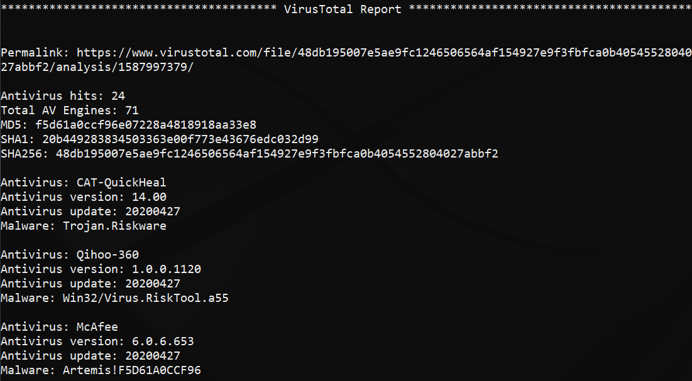

# VtReport
VtReport.py is a volatility plugin that allows a user to dump an executable file from a specified process' address space and submit the file to Virus Total for analysis. Elements of the report are printed to the console, e.g., hash values and AV detections. 

## Requirements
* Python 2 (2.6 or later)  
* [Latest stable release of volatility 2](https://github.com/volatilityfoundation/volatility)  
* [virustotal module](https://pypi.org/project/virustotal/)  
* [pathlib module](https://pypi.org/project/pathlib2/)  
* [Virus Total API Key](https://developers.virustotal.com/reference)  

## Usage
Place vtreport.py in the plugins folder  

``python2 vol.py -f <memory sample> --profile=<profile> vtreport -D </path/to/dump> -p <pid> -a <api key>``

## Example Output

